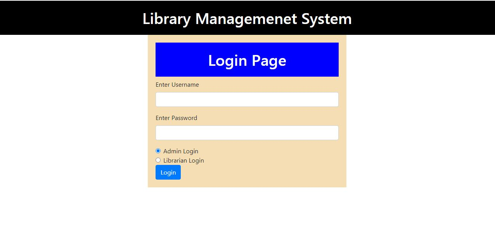
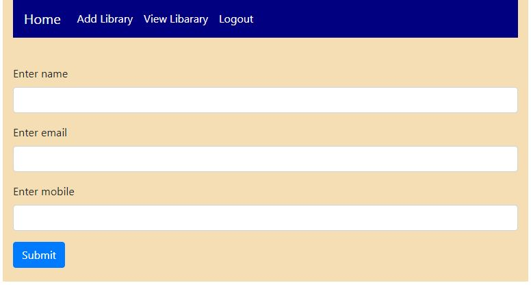
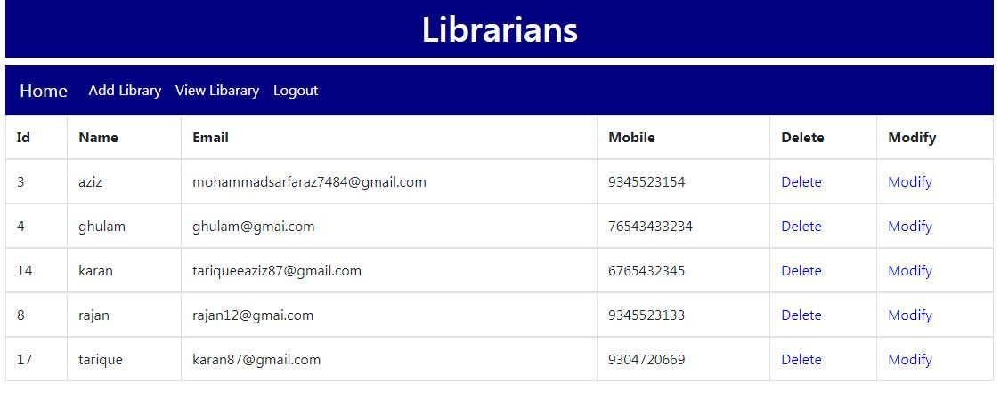
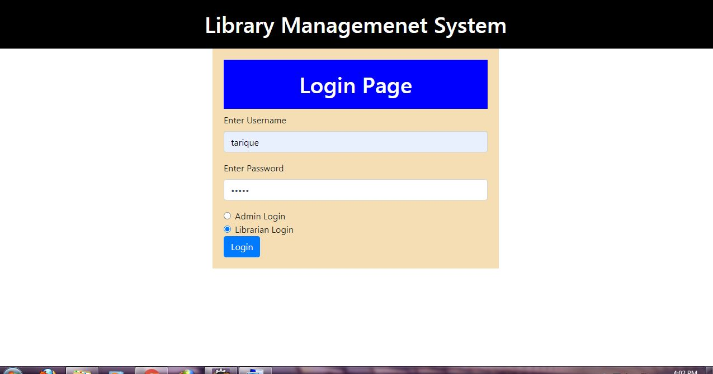
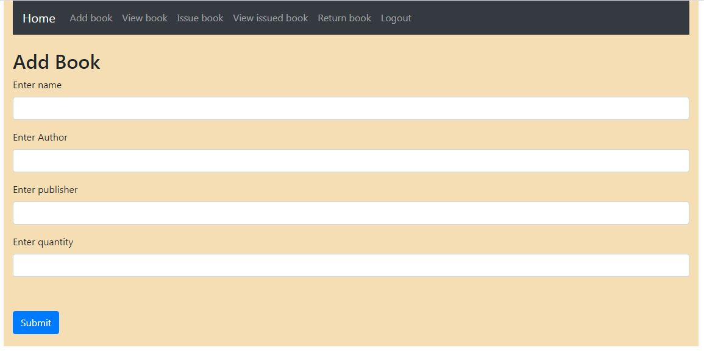
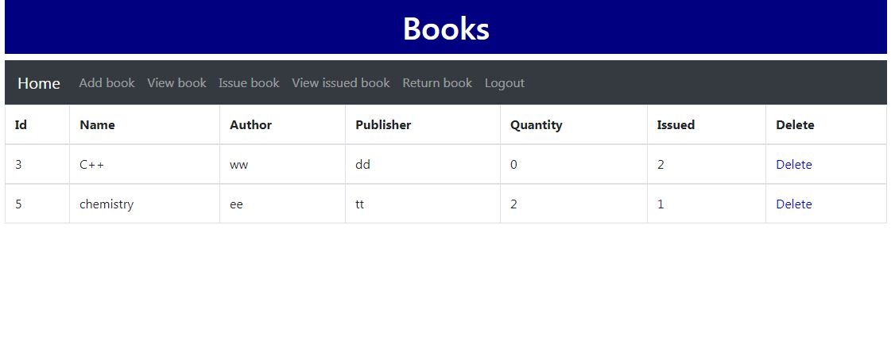
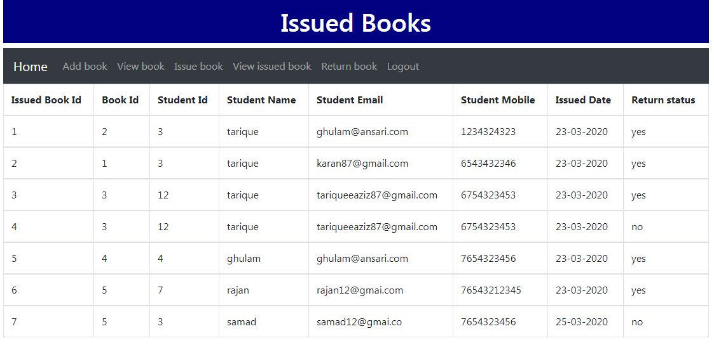
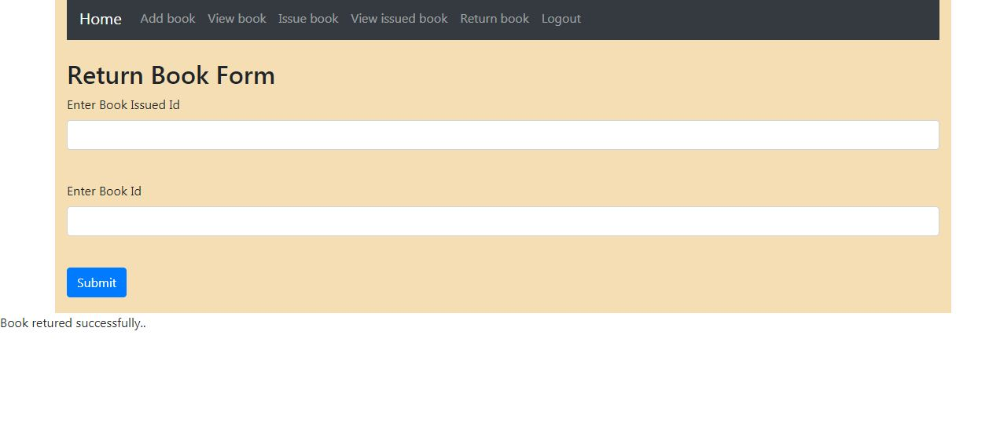

<h1>Library Management System</h1>  
<h2>I have done this project using HTML,CSS,BootStrap,Java,Servlet,JSP,JSTL,Hibernate,MySql etc.</h>
<h2>This project running on</h2>

Java 1.8 version

<p1>Apache Tomcat

MySql 6.0 version

